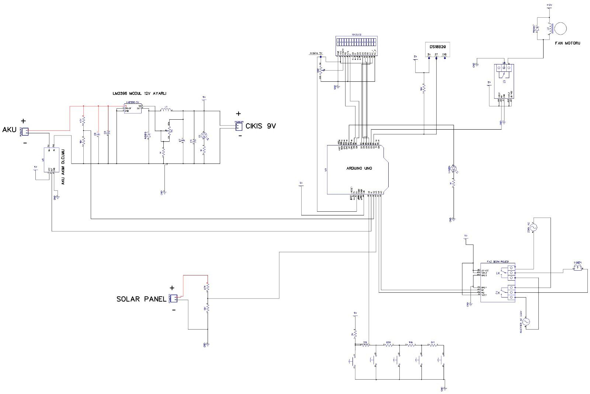

# HEMS-PV-Grid-Smart-Home
Smart Home Energy Management System with PV, SLA Battery, Custom Inverter, and Automatic Grid Transfer
# 🏡 Home Energy Management System (HEMS) by PV & Electrical Grid


This repository contains the complete engineering files for a **Smart Home Energy Management System (HEMS)** developed as a Bachelor of Science thesis project at **Pîrî Reis University (Department of Electrical and Electronics Engineering)**.

The system features a hybrid microgrid architecture prioritizing solar energy and battery storage (Mode A) with automatic, seamless fallback to the utility grid (Mode B) when solar generation is insufficient, functioning as an Uninterruptible Power Supply (UPS).

---

## 📌 Key System Features

* **Dual Power Source Switching:** Automatic transfer between Solar/Battery (Inverter output) and 220V AC Grid line based on real-time PV panel voltage thresholds ($V_{panel} > 13\text{V}$ for Solar, $V_{panel} < 12\text{V}$ for Grid) with a $1\text{V}$ hysteresis band.
* **Custom Inverter Board:** Built from scratch using a **CD4047** astable multivibrator IC calibrated to a precise $50\text{ Hz}$ output driving push-pull power MOSFETs and a $30\text{W}$ step-up transformer ($12\text{V} \rightarrow 220\text{V AC}$).
* **Custom Battery Charger:** **LM338** linear regulator circuit integrated with a $25\text{W } 0.56\,\Omega$ aluminum-housed current-limiting power resistor and anti-backfeed blocking diodes to safely charge a $12\text{V } 7\text{Ah}$ SLA battery.
* **Smart Climate Control:** Real-time temperature monitoring using a **DS18B20** digital sensor with an active $12\text{V DC}$ cooling fan triggered dynamically with $2^\circ\text{C}$ hysteresis.
* **Human-Machine Interface (HMI):** 16x2 LCD keypad shield for multi-page menu navigation (Current, Temperature, Voltages, and Manual Thermostat Setpoint adjustment).
* **Non-Blocking Firmware:** Arduino Uno firmware executing a non-blocking `millis()` polling loop with a software-based moving average digital filter for the **ACS712** current sensor.

---

## 📊 System Architecture & Operating Modes

| Mode | Condition | Power Source | Relay State | Battery Status |
| :--- | :--- | :--- | :--- | :--- |
| **Mode A** | $V_{panel} > 13.00\text{ V}$ | Solar / Battery Inverter | ENERGIZED (HIGH) | Charging via LM338 |
| **Mode B** | $V_{panel} < 12.00\text{ V}$ | Utility Grid ($220\text{V AC}$) | DE-ENERGIZED (LOW) | Idle / Backup |
| **Hysteresis** | $12.00\text{V} \le V_{panel} \le 13.00\text{ V}$ | Previous State | Unchanged | Unchanged |

---

## 📁 Repository Structure

```text
├── HEMS_PV_Grid_Graduation_Project.zip   # Complete package containing Arduino, MATLAB/Simulink, DipTrace & Docs

```
## 📸 System Overview & Hardware


*Figure 1: System schematic diagram.*


*Figure 2: Main electronic components and custom PCBs.*


*Figure 3: Final integrated physical hardware setup.*
